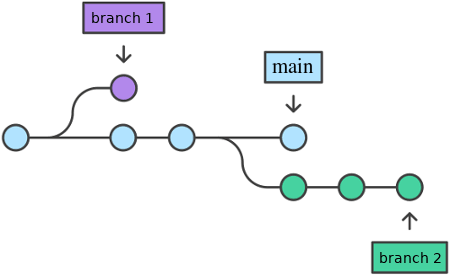
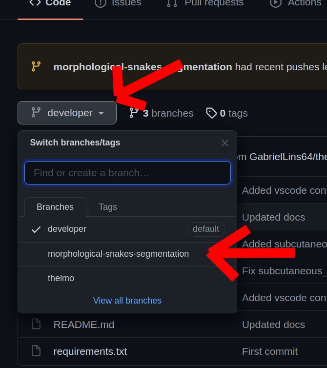
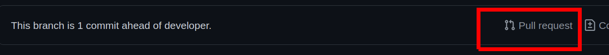
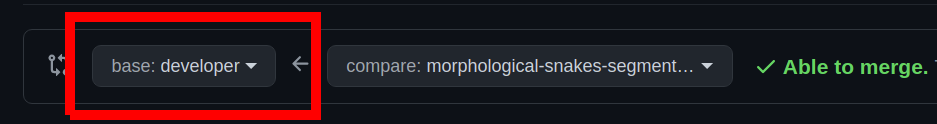
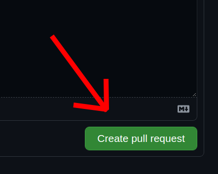
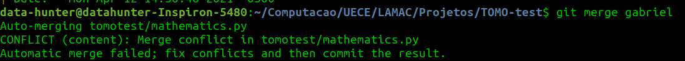
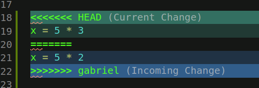

<h1>Laboratório de Matemática Computacional - LaMaC</h1>
<h3>Universidade Estadual do Ceará - UECE</h3>

---

<h2>Introdução ao Git</h2>

Este tutorial tem como finalidade ensinar princípios básicos de git.

---

<h3>Índice</h3>

- [O que é o Git](#o-que-é-o-git)
- [Branches](#branches)
- [Commit](#commit)
- [Push](#push)
- [Fetch e pull](#fetch-e-pull)
- [Merges e Pull Requests](#merges-e-pull-requests)
- [Conflitos de Merge](#conflitos-de-merge)

---

## O que é o Git

O Git é um sistema de controle de versões distribuído, usado principalmente no desenvolvimento de software, mas pode ser usado para registrar o histórico de edições de qualquer tipo de arquivo (Exemplo: alguns livros digitais são disponibilizados no GitHub e escrito aos poucos publicamente). O Git foi inicialmente projetado e desenvolvido por Linus Torvalds para o desenvolvimento do kernel Linux, mas foi adotado por muitos outros projetos.

Cada diretório de trabalho do Git é um repositório com um histórico completo e habilidade total de acompanhamento das revisões, não dependente de acesso a uma rede ou a um servidor central. O Git também facilita a reprodutibilidade científica em uma ampla gama de disciplinas, da ecologia à bioinformática, arqueologia à zoologia.

## Branches

Uma *branch* &ndash; galho &ndash; no git é um ponteiro para determinada ramificação de modificações nos arquivos do projeto. Isto é, podemos separar diferentes modificações num mesmo arquivo utilizando *branches*. O principal objetivo das *branches* é de organizar as diferentes modificações dos colaboradores.

Quando o trabalho de uma *branch* está pronto, ela é mesclada com a *branch* principal. A *branch* principal de um repositório era denominada *master*, mas por razões éticas e históricas esta nomenclatura mudou para **main**.

<p align="center">
  
</p>

Na *branch* **main** é onde todo o código de produção (que já foi testado, validado e liberado para o cliente) é colocado. Enquanto o código está ainda na fase de desenvolvimento e testes, utiliza-se uma *branch* **developer**. Como nosso repositório é destinado apenas a testes e experimentos, deixaremos apenas a *branch* **developer** como principal.

> <h3>Como utilizar:</h3>
> 
> Quando for desenvolver, **após puxar o código atualizado** da **developer**, crie uma nova *branch* com seu nome (Esta não é a maneira comum de utilizar *branches*, mas por conta das particularidades deste projeto utilizaremos estas práticas para facilitar). Para criar uma nova branch faça:
> > `$ git checkout -b nome-da-sua-branch`
> 
> Verifique sua *branch* atual com:
> > `$ git branch`
> 
> O comando acima mostra todas as *branches* locais e destaca a *branch* que está atualmente em uso.
> 
> Caso já tenha criado uma *branch* previamente, para mudar de *branch* basta utilizar o comando *checkout* sem a *flag* "-b":
> > `$ git checkout nome-da-sua-branch`
> 
> Após mudar para sua *branch*, pode desenvolver sem medo! Suas modificações não alterarão o trabalho dos outros desenvolvedores em outras *branches*.

Você só conseguirá modificar de *branch* após *commitar* (falaremos disso a seguir) ou dar um *stash* (esconder) todo o trabalho já feito (se houver algum).

## Commit

Após realizar as modificações necessárias na sua *branch*, pode-se *commitar* todo o trabalho feito e subir (enviar) para este repositório, ou deixar localmente se preferir. Para isto, adicione todas as modificações / inserções:

`$ git add .`

E submeta (*commit*):

`$ git commit`

Uma tela de comentário irá aparecer para que você escreva, na primeira linha, a descrição do seu *commit* como, por exemplo, "*Added geometric function for muscle segmentation*". Geralmente (no Linux), o editor padrão do git vem como o [*nano*](https://www.nano-editor.org/). Aconselho trocar para o [*Vim*](https://www.vim.org/). Para trocar o editor padrão:

`git config --global code.editor "vim"`

Caso deseje, pode também utilizar as próprias IDE's como Sublime ou VS Code:

`git config --global code.editor "subl -n -w"`
`git config --global code.editor "code --wait"`

Se quiser evitar abrir um editor para inserir a mensagem de *commit* pode inserí-la diretamente no comando:

`git commit -m "sua mensagem de commit"`

## Push

Após submeter suas modificações localmente, pode enviá-las ao repositório remoto no GitHub com o comando *push*:

`$ git push origin nome-da-sua-branch`

## Fetch e pull

Após o repositório remoto ser atualizado, seja por uma modificação ou inserção da *branch* de outro colaborador, ou mesmo pela mesclagem (*merge*) de uma *branch* na [developer](#branches), é uma boa prática manter seu repositório local sincronizado com o remoto.

Para isto, devemos trazer (*fetch*) as atualizações remotas com um *fetch*:

`$ git fetch origin`

Digamos que você está trabalhando numa *branch* denominada "*morphological-snakes-segmentation*" e outro colaborador também. Mas então este outro colaborador conseguiu implementar uma funcionalidade e fez *commit* e *push* no código. Para você trazer as modificações desta *branch*, basta dar o comando acima. No entanto, as modificações não serão automaticamente mergeadas na branch *morphological-snakes-segmentation*. Elas serão trazidas para uma branch com o nome: ***origin/morphological-snakes-segmentation***. Caso queira trazer todo o trabalho do outro colaborador para sua branch local de fato, deve-se dar um [merge](#merges-e-pull-requests):

`$ git merge origin/morphological-snakes-segmentation`

**Importante**: Caso as alterações do outro colaborador não tenham mexido em nenhuma parte do código específica na qual você também estava mexendo nesta mesma *branch*, o merge será feito sem nenhum problema com o comando acima. No entanto, caso haja alterações suas e do outro colaborador em uma mesma variável, por exemplo, haverá um [conflito de merge](#conflitos-de-merge) que deverá ser resolvido.

Caso queira fazer o processo de *fetch* e *merge* diretamente, basta dar um **pull**:

`git pull origin`

O comando acima equivale a:

```
$ git fetch origin
$ git merge origin/branch-em-uso
```

## Merges e Pull Requests

A mesclagem de códigos pode ser feita localmente ou através do GitHub (que avisa quando há ou não conflitos de merge).

Para fazer um merge, digamos, de nossa *branch* *morphological-snakes-segmentation* na *branch* *developer* localmente (não recomendado), basta navegar até a branch *developer* e dar um merge da outra branch:

```
$ git checkout developer
Switched to branch 'developer'
$ git merge morphological-snakes-segmentation
```

E os comandos acima trarão os *commits* de nossa branch para a *developer*.

Para fazer este mesmo processo pelo GitHub, faça seus commits em sua branch, dê um [push](#push) para origin, e, no GitHub, navegue até sua branch:

<p align="center">
  
</p>

Clique em "*Pull Request*":

<p align="center">
  
</p>

Escolha a branch base na qual os novos commits vão entrar:

<p align="center">
  
</p>

E, por fim, clique em "*Create pull request*", então espere outro colaborador avaliar e mergear o novo código:

<p align="center">
  
</p>

## Conflitos de Merge

Quando fazemos merge e duas partes de um mesmo código possuem diferentes modificações nos 2 commits mergeados, haverá um conflito de merge. Por exemplo, suponha que na minha branch *developer* atribuí uma variável x = 5 * 3, mas em outra branch *branch-x* atribuí x = 5 * 2, e commitei ambas as branches. Quando tentar mergear a branch *branch-x* na *developer* o seguinte aviso irá aparecer:

<p align="center">
  
</p>

E devemos resolver o conflito manualmente no código. Não é complicado, quando formos à seção do código que está conflitando, veremos o seguinte:

<p align="center">
  
</p>

Então, só precisamos decidir o que vai, de fato, ficar no código da *developer*. Para isto, removemos todas as linhas com "<<<<<<< HEAD", "=======", ">>>>>>> incoming-branch" e também o código que não irá ficar na developer. Então o conflito desaparecerá e você poderá terminar o merge de maneira um pouco diferente do commit:

```
$ git add .
$ git merge --continue
```

> **Importante:**
> Para atualizar a branch que foi mergeada na developer, como estamos partindo do mesmo commit, o mais recomendado é deletar a outra branch e criá-la a partir da branch mais atualizada (a developer, neste caso). Então, estando na branch developer após o merge, faça:
> ```
> $ git branch -D branch-x # Deleta a branch branch-x
> $ git checkout -b branch-x # Cria novamente a branch, a partir da developer.
> ```

--- 
