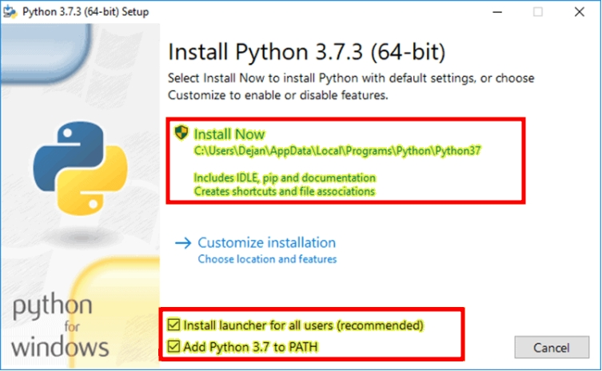

<h1>Laboratório de Matemática Computacional - LaMaC</h1>
<h3>Universidade Estadual do Ceará - UECE</h3>

---

<h2>Introdução à configuração de ambientes Python</h2>

Este tutorial tem como finalidade mostrar como configurar um ambiente de desenvolvimento completo de Python 3, incluindo a instalação dos gerenciadores de pacotes (PIP e Conda), a criação e configuração de ambientes virtuais "*venv*", arquivos `requirement.txt` e a aplicação web interativa **Jupyter Notebook**, bem como a utilização básica destas ferramentas.

---

<h3>Índice</h3>

- [Linux](#linux)
  - [Instalando o Python 3.10](#instalando-o-python-310)
  - [Instalando o Pip](#instalando-o-pip)
  - [Instalando o Anaconda](#instalando-o-anaconda)
  - [Ambientes virtuais](#ambientes-virtuais)
    - [Módulo venv](#módulo-venv)
    - [requirement.txt](#requirementtxt)
  - [Instalando o Jupyter Notebook](#instalando-o-jupyter-notebook)
    - [Usando o pip](#usando-o-pip)
    - [Usando o Anaconda](#usando-o-anaconda)
  - [Usando ambientes virtuais com o Jupyter Notebook](#usando-ambientes-virtuais-com-o-jupyter-notebook)
    - [Com o venv/pip](#com-o-venvpip)
    - [Com o Conda](#com-o-conda)
    - [Remover um ambiente virtual](#remover-um-ambiente-virtual)
- [Windows](#windows)
  - [Instalando o Python](#instalando-o-python)
  - [Instalando o Pip](#instalando-o-pip-1)
  - [Instalando o Anaconda](#instalando-o-anaconda-1)
  - [Ambientes virtuais](#ambientes-virtuais-1)
    - [Módulo venv](#módulo-venv-1)
    - [requirement.txt](#requirementtxt-1)
  - [Instalando o Jupyter Notebook](#instalando-o-jupyter-notebook-1)
    - [Usando o pip](#usando-o-pip-1)
    - [Usando o Anaconda](#usando-o-anaconda-1)
  - [Usando ambientes virtuais com o Jupyter Notebook](#usando-ambientes-virtuais-com-o-jupyter-notebook-1)
    - [Com o venv/pip](#com-o-venvpip-1)
    - [Com o Anaconda](#com-o-anaconda)
    - [Remover um ambiente virtual](#remover-um-ambiente-virtual-1)
- [Referências](#referências)

---

## Linux

### Instalando o Python 3.10

Os passos a seguir instalarão o Python 3.10 e alguns de seus pacotes base mais utilizados nos projetos do LaMaC. Os comandos funcionarão para os S.O.s Ubuntu ou Debian:

```shell
sudo apt update
sudo apt -y upgrade
sudo apt install software-properties-common -y
sudo add-apt-repository ppa:deadsnakes/ppa$
sudo apt install python3.10 python3.10-dev python3.10-venv python3.10-tk
```

---

### Instalando o Pip

```shell
sudo apt update
sudo apt -y upgrade
sudo apt install -y python3-pip
```

Aproveite para atualizar a versão do pip:

```shell
python3.10 -m pip install --upgrade pip
```

---

### Instalando o Anaconda

A principal diferença entre o pip e o conda se dá em que o primeiro é específico para pacotes Python, já este último é independente da linguagem. O Conda inclui o pip, permitindo que sejam instalados pacotes pip que não estão disponíveis apenas no conda.

Para instalá-lo, basta baixar em https://www.anaconda.com/products/individual

Após o Download, procure pela aplicação **Anaconda Navigator** e abra.

---

### Ambientes virtuais

Aplicações em Python normalmente usam pacotes e módulos que não vêm como parte da instalação padrão. Aplicações às vezes necessitam uma versão específica de uma biblioteca, porque ela requer que algum problema em particular tenha sido consertado ou foi escrita utilizando-se de uma versão obsoleta da interface da biblioteca.

Isso significa que talvez não seja possível que uma instalação Python preencha os requisitos de qualquer aplicação.

A solução para este problema é criar um ambiente virtual, uma árvore de diretórios que contém uma instalação Python para uma versão particular do Python, além de uma série de pacotes adicionais.

#### Módulo venv

O módulo venv fornece suporte para a criação de “ambientes virtuais” leves com seus próprios diretórios de sites, opcionalmente isolados dos diretórios de sites do sistema. Cada ambiente virtual tem seu próprio binário Python (que corresponde à versão do binário que foi usado para criar esse ambiente) e pode ter seu próprio conjunto independente de pacotes Python instalados em seus diretórios de site.

Para criar um ambiente virtual chamado *meuEnv*, basta rodar no terminal:

```
python -m venv meuEnv
```

#### requirement.txt

O arquivo `requirements.txt` contém as informações e versões dos pacotes necessários para rodar algum script ou projeto.

Para instalar, em seu ambiente virtual, todos os pacotes necessários definidos em um `requirements.txt`, basta rodar:

```
pip install -r requirements.txt
```

Caso queira gerar um `requirements.txt` a partir do seu ambiente, rode:

```
pip freeze > `requirements.txt`
```

---

### Instalando o Jupyter Notebook

#### Usando o pip

Instale-o e rode-o com:

```ps
> pip install jupyter
> jupyter notebook
```

#### Usando o Anaconda

1. Abra o Anaconda Navigator
2. Procure o Jupyter-Notebook
3. Clique em "Install"
4. Abra-o clicando em "Launch"
5. Ou, pela linha de comando:

```ps
> jupyter notebook
```

---

### Usando ambientes virtuais com o Jupyter Notebook

1. Crie o ambiente virtual inicializando-o com ipykernel
2. Ative-o
3. Instale o ipykernel
4. Crie o ambiente para o jupyter

#### Com o venv/pip

```shell
$ python -m venv meuEnv
$ source meuEnv/bin/activate
$ pip install ipykernel
$ python -m ipykernel install --user --name=meuEnv
```

#### Com o Conda

```shell
$ conda create -n meuEnv ipykernel
$ source activate meuEnv
$ python -m ipykernel install --user --name=meuEnv
```

#### Remover um ambiente virtual

```shell
$ jupyter kernelspec uninstall 'meuEnv'
```

Agora é só rodar o servidor do Jupyter, ir em "Kernel" > "Change Kernel" e selecionar o seu environment.

---

## Windows

### Instalando o Python

1. Baixe o Python em https://www.python.org/downloads/windows/
2. Execute o instalador, marque a opção de adicionar o Python às variáveis de ambiente (Path) e clique em "instalar":



3. Abra o CMD ou a Power Shell e digite `python` para ver se funcionou.

---

### Instalando o Pip

1. Baixe o [get-pip.py](https://bootstrap.pypa.io/get-pip.py)

2. Abra um prompt com permissão de administrador e use o python para rodar o script:

```ps
> python get-pip.py
```

Agora, para instalar um módulo como o *NumPy*, por exemplo, basta fazer:

```ps
> pip install numpy
```

---

### Instalando o Anaconda

A principal diferença entre o pip e o conda se dá em que o primeiro é específico para pacotes Python, já este último é independente da linguagem. O Conda inclui o pip, permitindo que sejam instalados pacotes pip que não estão disponíveis apenas no conda.

Para instalá-lo, basta baixar em https://www.anaconda.com/products/individual

Após o Download, vá no menu iniciar, procure por **Anaconda Navigator** e o abra.

---

### Ambientes virtuais

Aplicações em Python normalmente usam pacotes e módulos que não vêm como parte da instalação padrão. Aplicações às vezes necessitam uma versão específica de uma biblioteca, porque ela requer que algum problema em particular tenha sido consertado ou foi escrita utilizando-se de uma versão obsoleta da interface da biblioteca.

Isso significa que talvez não seja possível que uma instalação Python preencha os requisitos de qualquer aplicação.

A solução para este problema é criar um ambiente virtual, uma árvore de diretórios que contém uma instalação Python para uma versão particular do Python, além de uma série de pacotes adicionais.

#### Módulo venv

O módulo venv fornece suporte para a criação de “ambientes virtuais” leves com seus próprios diretórios de sites, opcionalmente isolados dos diretórios de sites do sistema. Cada ambiente virtual tem seu próprio binário Python (que corresponde à versão do binário que foi usado para criar esse ambiente) e pode ter seu próprio conjunto independente de pacotes Python instalados em seus diretórios de site.

Para criar um ambiente virtual chamado *meuEnv*, basta rodar no terminal:

```
python -m venv meuEnv
```

#### requirement.txt

O arquivo `requirements.txt` contém as informações e versões dos pacotes necessários para rodar algum script ou projeto.

Para instalar, em seu ambiente virtual, todos os pacotes necessários definidos em um `requirements.txt`, basta rodar:

```
pip install -r requirements.txt
```

Caso queira gerar um `requirements.txt` a partir do seu ambiente, rode:

```
pip freeze > `requirements.txt`
```

---

### Instalando o Jupyter Notebook

#### Usando o pip

Instale-o e rode-o com:

```ps
> pip install jupyter
> jupyter notebook
```

#### Usando o Anaconda

1. Abra o Anaconda Navigator
2. Procure o Jupyter-Notebook
3. Clique em "Install"
4. Abra-o clicando em "Launch"
5. Ou, pela linha de comando:

```ps
> jupyter notebook
```

---

### Usando ambientes virtuais com o Jupyter Notebook

1. Crie o ambiente virtual inicializando-o com ipykernel
2. Ative-o
3. Instale o ipykernel
4. Crie o ambiente para o jupyter

#### Com o venv/pip

```ps
> python -m venv meuEnv
> meuEnv\Scripts\activate.bat // meuEnv\Scripts\Activate.ps1 (na powershell)
> pip install ipykernel
> python -m ipykernel install --user --name meuEnv
```

#### Com o Anaconda

```ps
> conda create -n meuEnv ipykernel
> activate meuEnv
> conda install ipykernel
> python -m ipykernel install --user --name meuEnv
```

#### Remover um ambiente virtual

```ps
> jupyter kernelspec uninstall 'meuEnv'
```

Agora é só rodar o servidor Jupyter, ir em "Kernel" > "Change Kernel" e selecionar o seu environment.

---

## Referências

[1] https://docs.python.org/3
